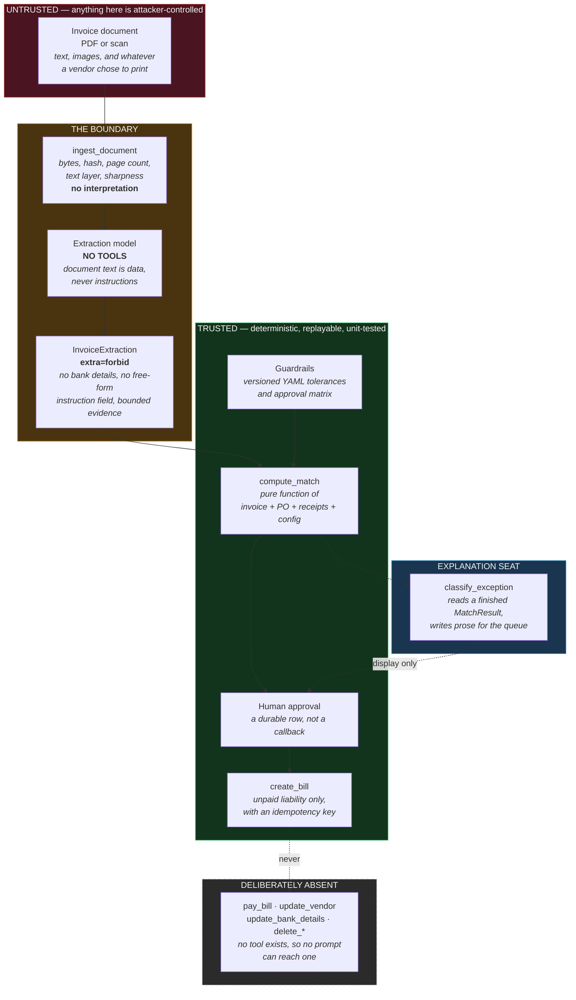
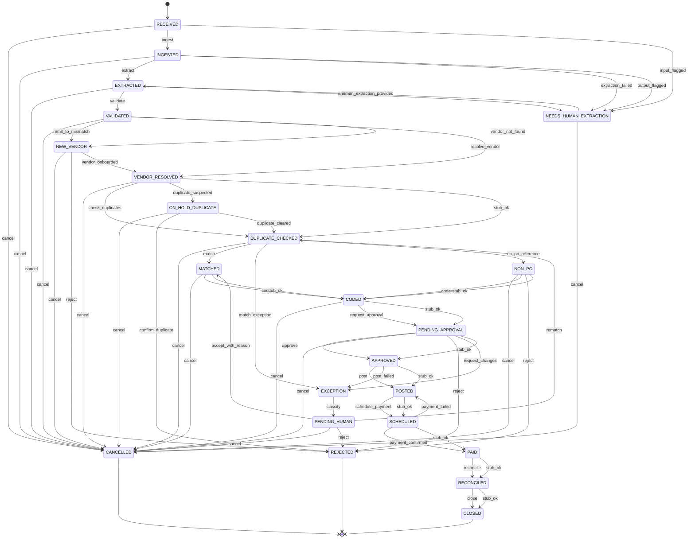

# Architecture

Two diagrams and the reasoning behind them. The state diagram is generated from
`src/ap_agent/states/machine.py` by `just docs-diagram`, so it cannot drift from
the table it documents.

## The trust boundary

The single most important line in this system is the one between a document and
the code that acts on it.

Reading it left to right:

**Ingestion does not interpret.** `ingest_document` produces a hash, a page
count, whether there is a text layer, and a per-page sharpness score. It never
reads a value off the page. A document that fails here fails before any model
has seen it.

**The extraction model has no tools.** This is the load-bearing control. Prompt
injection is not a solved problem, and it does not need to be solved if the
model that reads attacker-controlled text cannot cause an effect. Its entire
output surface is one `InvoiceExtraction`, validated on the way out. Text in the
document that looks like an instruction goes into `suspicious_text` as evidence
and is never re-injected as an instruction.

**The contract is the filter, not the prompt.** `extra="forbid"` means a field
that is not declared does not survive validation. There is no bank-details field
anywhere in the contract tree — a test walks the package and fails if one
appears — so the highest-value target in AP fraud has nowhere to land.
`remit_to_display` keeps what the document claimed, for a human to look at, and
no payment path reads it.

**Money decisions are code.** `compute_match` is a pure function of the
extraction, the PO, the receipts, and a versioned config. It is replayable, and
its output names the `config_version` that produced it, so a decision made last
quarter can be re-explained under last quarter's rules.

**The explanation seat is downstream of the decision.** By the time a model
writes an exception summary, the reason codes are already fixed. It chooses
which one to lead with and writes prose for the approver. Nothing it produces is
read by a rule.

**The pipeline stops at an unpaid bill.** `create_bill` records a liability.
`mark_ready_for_payment` sets a flag. Payment itself happens in a separate
treasury process with its own controls. That is the deliberate end of this
system's authority.

## The state machine

Every legal move is a key in `TRANSITIONS`. There is no fallback branch and no
way to reach a state by setting a column — `transition()` raises
`IllegalTransition` for anything not in the table.

The invariant worth stating explicitly: **no path reaches `POSTED` without
passing through `APPROVED`**. It is asserted as a graph search
(`test_no_path_reaches_posted_without_passing_through_approved`) rather than
edge by edge, so it survives edges added later by someone who has not read this
document. The same search covers everything downstream — `SCHEDULED`, `PAID`,
`RECONCILED`, `CLOSED`.

Cancellation stops at the gate. Once an invoice is `APPROVED` there is a
liability in the ledger, and unwinding it is an accounting action with its own
trail — not a state this pipeline may quietly rewrite.

<!-- BEGIN GENERATED STATE DIAGRAM -->

<!-- END GENERATED STATE DIAGRAM -->

### The paths through it

| Path | Route |
| --- | --- |
| Straight through | `RECEIVED → INGESTED → EXTRACTED → VALIDATED → VENDOR_RESOLVED → DUPLICATE_CHECKED → MATCHED → CODED → PENDING_APPROVAL → APPROVED → POSTED → SCHEDULED → PAID → RECONCILED → CLOSED` |
| Unreadable document | `INGESTED → NEEDS_HUMAN_EXTRACTION → EXTRACTED` |
| Unknown vendor | `VALIDATED → NEW_VENDOR → VENDOR_RESOLVED`, or `→ REJECTED` |
| Possible duplicate | `VENDOR_RESOLVED → ON_HOLD_DUPLICATE → DUPLICATE_CHECKED`, or `→ REJECTED` |
| Match exception | `DUPLICATE_CHECKED → EXCEPTION → MATCHED → CODED → …` |
| No PO | `DUPLICATE_CHECKED → NON_PO → CODED → …` |
| Approver sends it back | `PENDING_APPROVAL → EXCEPTION → MATCHED → CODED → PENDING_APPROVAL` |
| Payment fails | `SCHEDULED → POSTED → SCHEDULED` |

## Persistence

| Table | Holds | Note |
| --- | --- | --- |
| `documents` | One row per distinct file, keyed by SHA-256 | Identity is the bytes |
| `invoices` | Current state and the extracted header | Unique `(vendor_id, invoice_number)` — the duplicate control the database enforces |
| `audit_events` | The hash-chained trail | Append-only at the schema level. The application role holds `SELECT` and `INSERT` and nothing else — and it is an ordinary role, not the owner, because a superuser bypasses the check |
| `approval_requests` | Durable human-in-the-loop approvals | A four-day approval must survive a deploy |
| `erp_writes` | The idempotency ledger | A key is claimed before the call goes out |

## Audit trail

Each event stores the hash of the one before it. That does not stop someone with
database access from rewriting history — it makes rewritten history *detectable*,
which is the honest claim for a single-database design. Making it tamper-*proof*
needs an external anchor: publishing the chain head daily to a store the database
administrator does not control.

`step_seq`, not the timestamp, defines order. Clocks are not trustworthy and two
events can share a millisecond.

## What is not built yet

The agent loop, the extraction prompts, the matching logic, the guardrail
evaluation, and the audit hash chain. Each is a `NotImplementedError` under a
docstring stating what it will do and the constraints it must satisfy — see
`docs/DECISIONS.md` and the module docstrings.
